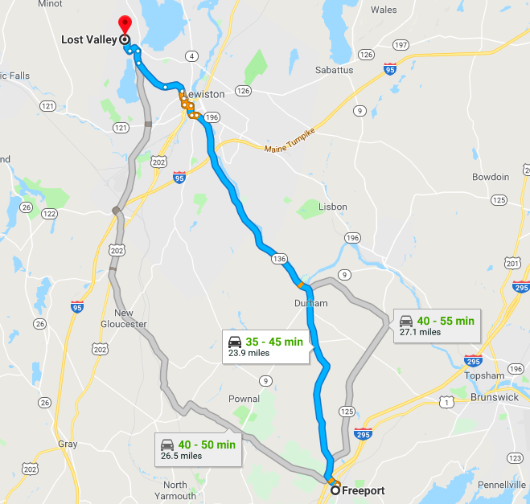

This is the documentation and blog for the **Thwack Timing Gate**, a low-cost, open-source, wireless timing system for alpine skiing.

> You can learn more about **us and our story** below, read the **[blog](blogLink)**, see the devices coolest **[features](featuresLink)**, or just skip straight to **the technical stuff** with the links on the left.

> Have inquirys, well-wishes, or just existential musings? Send them our way at <b><a href="mailto:thwack.timingsystems@gmail.com">Thwack.TimingSystems@gmail.com</a></b>

---

## Bios
#### Paul Biberstein
##### Software Monkey, CAD Hermit and Documentation Curmudgeon
##### Skis Sugarloaf
Lorem ipsum dolor sit amet, consectetur adipiscing elit. Nam placerat massa ac velit viverra tristique. Nullam lacinia arcu est, in dictum ligula euismod vel. Vivamus ligula ante, pellentesque id sodales sit amet, hendrerit at risus. Vivamus ut purus sit amet risus faucibus volutpat. Integer et mi dictum, pellentesque diam sed, ullamcorper libero.
#### Jacob Selian
##### Mechanical Guru and Sensor Wizard
##### Skied Saddleback until 2015 (RIP Saddleback)
Lorem ipsum dolor sit amet, consectetur adipiscing elit. Nam placerat massa ac velit viverra tristique. Nullam lacinia arcu est, in dictum ligula euismod vel. Vivamus ligula ante, pellentesque id sodales sit amet, hendrerit at risus. Vivamus ut purus sit amet risus faucibus volutpat. Integer et mi dictum, pellentesque diam sed, ullamcorper libero.

---

## Our Story

This website hosts the work of two students at [Freeport High School](freeportLink)—Paul Biberstein and Jacob Selian—as they design and construct the **Thwack Timing Gate**, a low-cost, open-source, wireless timing system for alpine skiing.

What is the Thwack Timing Gate exactly? Well, the idea started back in the winter of 2018. The two high school students, both avid members of Freeport High School's alpine ski race team, found themselves training late into the night at [Lost Valley](lostValleyLink) ski mountain. Nocturnal practices were required, as the few days of the week the team could secure a bus to make the 40 minute journey to the mountain needed to be maximized. So they would spend hours on the mountain, racing through a ragtag set of 20 or so slalom gates, then go back up the lift and do it again.

 The arduous journey from Freeport to Lost Valley

Somewhere along the way, an idea came into being. If our opportunities to train are so few and far between, why not make the most of the times when we can train? Specifically, why don't we time our runs down the practice course so we can see which techniques improve our time and which ones make us slower.

Surely a brilliant idea, but the logistical problems of watch and phone stopwatches mounted up and the duo soon realized that this was no small task. In fact, many larger corporations make just such consumer grade wireless timing systems. However, these kits cost somewhere in the range of a [few thousand dollars](browerLink) or more—outside the ski team's budget.

The boys were convinced they could do it for less and were further encouraged as time progressed by the potential market for the system. Other team's coaches expressed interest, and as the track and field season began it became clear that a similar timing system would be indispensable to dedicated sprinters as well as skiers. 

So, as many enterprising entrepreneurs had done before them, they set out with the noble cause of making a low-cost product in a stagnant industry. Further, they decided to keep a blog along the way and open source any and all designs and code they came up with, to hopefully help future engineers  understand the more esoteric parts of microcontrollers, programming, and CAD.

---

TODO add ski videos "if you got this far, why not look at some ski videos". "Got some funny ones, send them our way and we'll put them here"

[blogLink]: https://thwacktiminggate.com/blog/
[featuresLink]: https://thwacktiminggate.com/features/
[freeportLink]: http://www.rsu5.org/school_home.aspx?schoolId=1
[lostValleyLink]: http://www.lostvalleyski.com/
[browerLink]: https://worldcupsupply.com/product/brower-bib-id-xs-training-system/